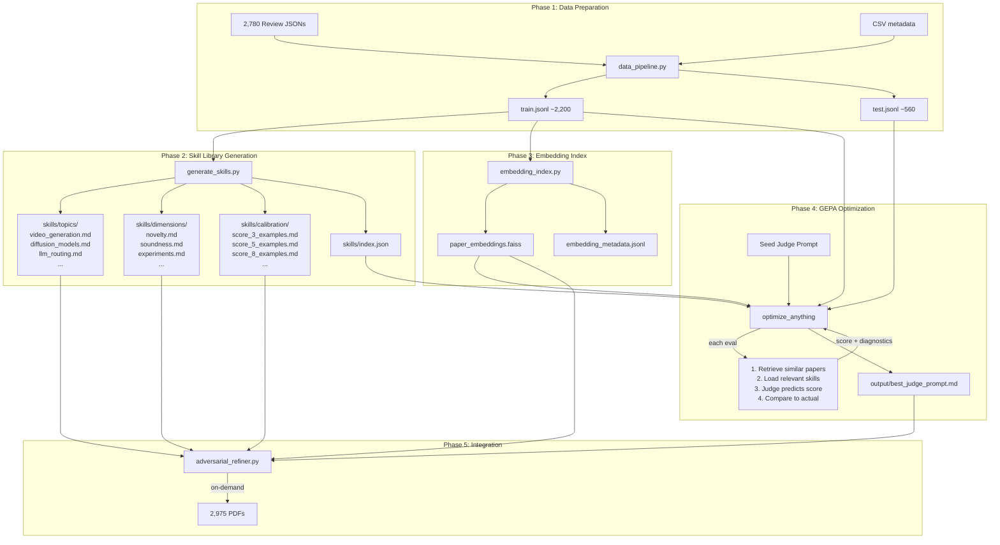

# Train a Calibrated Judge Agent via GEPA

## Problem

The current Judge gives inflated scores (8/10 with fundamental flaws still present), tracks relative improvement rather than absolute quality, and has no calibration against real conference standards. The 40-round DAS-3D experiment demonstrates this: the judge gave "Ready/Converging" signals while wrong SNR schedules, missing competitors, and X.XX placeholders persisted for 16-34 rounds.

## Core Scalability Insight

We have 2,780 papers with reviews and 2,975 PDFs. We cannot fit them into a prompt. The solution is a **3-layer knowledge architecture** where each layer compresses differently:

1. **Core prompt (GEPA-optimized)**: Learns *how to evaluate* from trial-and-error on hundreds of papers. Compact (~3-5K tokens) but encodes learned evaluation heuristics. Think of this as the "model weights."
2. **Skill library (dynamically loaded)**: A directory of detailed skill files — one per topic area, evaluation dimension, or score tier. Each file is 5-20K tokens. Total library can be 200K+ tokens. The agent loads only the 2-3 relevant files per evaluation. Think of this as a "textbook the agent can open to the right chapter."
3. **Retrieved context (embedding search)**: For each idea being evaluated, retrieve the 5-10 most similar published papers with their abstracts, review scores, and key reviewer quotes. This provides concrete comparison points. Think of this as "here are papers most like yours, and here's what reviewers said about them."

Plus **on-demand PDF loading** — the agent reads full PDFs when it needs to deeply verify a specific claim.

## Data Available

- **2,780 review JSONs** — rating (1-10), soundness (1-4), presentation (1-4), contribution (1-4), confidence (1-5), plus full-text strengths/weaknesses/questions
- **2,975 PDFs** of actual papers
- **~34K paper metadata** in CSVs (title, abstract, keywords, decision, venue, year)
- Papers span ICLR 2024/2025/2026, ICML 2025, NeurIPS 2024/2025

## Architecture




## Phase 1: Data Preparation

Create `judge_training/data_pipeline.py`:

- Parse all 2,780 review JSONs (both ICLR topic-level Format 1 and Author-level Format 2) into a unified schema:

```python
{
    "paper_id": str,
    "title": str,
    "abstract": str,
    "keywords": list[str],
    "primary_area": str,
    "venue": str,
    "year": int,
    "decision": str,
    "avg_rating": float,
    "ratings": list[float],
    "avg_soundness": float,
    "avg_contribution": float,
    "avg_presentation": float,
    "review_texts": list[{
        "strengths": str,
        "weaknesses": str,
        "questions": str,
        "rating": int
    }],
    "pdf_path": str | None
}
```

- Split 80/20 stratified by `avg_rating` (binned into tiers: 1-3, 4-5, 6-7, 8-10) and venue
- Output: `judge_training/data/train.jsonl`, `judge_training/data/test.jsonl`

## Phase 2: Skill Library Generation

Create `judge_training/generate_skills.py`.

This is the scalable knowledge layer. Instead of one monolithic distilled prompt, generate a **library of skill files** organized by category. The agent loads only the relevant files at evaluation time.

**Skill categories:**

**A. Topic skills** (`skills/topics/{topic}.md`, ~10-20K tokens each):

- One file per research area: `video_generation.md`, `diffusion_models.md`, `llm_routing.md`, `motion_generation.md`, `world_models.md`, etc.
- Contains: what reviewers praise/criticize in this area, required baselines/metrics, common technical pitfalls, key cited papers, score distribution and acceptance bar
- Generated via agentic PDF reading (see generation process below)

**B. Dimension skills** (`skills/dimensions/{dimension}.md`, ~5-10K tokens each):

- One file per evaluation axis: `novelty.md`, `soundness.md`, `experiments.md`, `clarity.md`, `significance.md`, `reproducibility.md`
- Cross-topic patterns about what makes a paper strong/weak on each dimension
- Real reviewer quotes exemplifying each score level on that dimension

**C. Calibration skills** (`skills/calibration/score_{N}.md`, ~5-10K tokens each):

- One file per score tier: `score_2_3.md`, `score_4_5.md`, `score_6_7.md`, `score_8_10.md`
- Real paper examples at each tier with: title, abstract snippet, key reviewer comments, and why it got that score

**D. Skill index** (`skills/index.json`):

- Maps topics/keywords to skill file paths for dynamic loading at eval time

**Total skill library size**: ~~30-50 files, ~200-500K tokens total. The agent only loads 2-4 relevant files per evaluation (~~20-40K tokens).

**Generation process** — agentic, 2-step per skill file:

**Step 1: Statistical extraction (Python, no LLM)**:
For each topic, compute from all papers in that category: score distribution (mean, median, std, acceptance rate), most frequent phrases in reviewer weaknesses/strengths grouped by score tier, expected baselines and metrics mentioned in reviews.

**Step 2: Agentic skill synthesis (one Claude Code session per skill file)**:
Give a Claude Code agent the statistics from Step 1 plus a **manifest** of all papers in this topic (title, score, decision, PDF path, review JSON path). The agent autonomously reads ~~15 papers on demand — starting with the highest and lowest scoring papers, then borderline cases, adapting its reading strategy based on what patterns it discovers. It reads actual paper PDFs (methods, experiments, results) plus their review JSONs to produce technically grounded skill files. Budget: ~30 min per topic. All topics can run in parallel (~~20 topics = ~30-60 min wall-clock).

Dimension and calibration skill files are generated the same way, but sampling across topics rather than within a single topic.

**Validation**: For each generated skill file, test on a holdout subset of papers from that topic. If the judge predicts scores more accurately WITH the skill loaded than without it, keep it; otherwise regenerate.

## Phase 3: Embedding Index for Paper Retrieval

Create `judge_training/embedding_index.py`:

- Embed all papers (title + abstract) using `text-embedding-3-small` (or a local model like `all-MiniLM-L6-v2` for zero cost)
- Store vectors in a FAISS index for fast nearest-neighbor search
- Store metadata alongside: `{paper_id, title, abstract_snippet, venue, year, avg_rating, decision, review_summary}`
- At evaluation time: embed the current idea -> retrieve top-K (5-10) most similar published papers -> inject their metadata + review highlights into the judge's context

This gives the judge **concrete comparison points**: "Here are the 5 most similar papers that were actually reviewed at top venues. Paper A scored 7.5 and was accepted; Paper B scored 4.0 and was rejected for lacking ablations."

The retrieval context adds ~3-5K tokens per evaluation but provides domain-specific grounding that no amount of general heuristics can match.

## Phase 4: Evaluation Harness + GEPA Optimization

Create `judge_training/eval_harness.py` and `judge_training/optimize.py`.

**Evaluation pipeline** (what happens for each paper during GEPA training):

1. **Retrieve** similar papers from the embedding index (top 5)
2. **Select skills** based on the paper's topic/keywords (1-2 topic skills + 1 calibration file)
3. **Assemble context**: core prompt + loaded skill files + retrieved papers + the paper to evaluate
4. **Run judge**: LLM predicts rating (1-10), soundness (1-4), contribution (1-4), accept/reject, reasoning
5. **Score**: Compare predictions to actual review scores

**Scoring metric**:

- Primary: `1 - MAE(predicted_rating, avg_rating) / 9` (normalized to 0-1, higher is better)
- Secondary: accept/reject accuracy, Spearman rank correlation
- Diagnostic ASI for GEPA: per-case feedback showing what the judge predicted vs actual, and what the reviewers actually said

**What GEPA optimizes**: The core judge prompt (the "meta-prompt" that tells the judge how to use skills, how to weight retrieved context, how to score, etc.). The skill files are pre-generated and fixed; GEPA evolves the instructions for how to use them.

**GEPA integration** using `optimize_anything` in Generalization mode:

```python
import gepa.optimize_anything as oa

result = oa.optimize_anything(
    seed_candidate=seed_judge_prompt,
    evaluator=evaluate_judge_with_skills_and_retrieval,
    dataset=train_papers,
    valset=test_papers,
    max_evals=200,
    objective="Predict paper review scores accurately using skill files and retrieved context"
)
```

**Cost management**: Use GPT-4o-mini or Claude Haiku for the judge during training. The optimized prompt transfers to Claude Sonnet/Opus for production. Batch size of ~10-20 papers per eval.

## Phase 5: Integration into Adversarial Refiner

Modify [adversarial_refiner.py](idea_refiner/adversarial_refiner.py):

- The judge's system prompt becomes the GEPA-optimized meta-prompt
- Add to `_RESOURCES_BLOCK`:
  - Path to the skill library: `judge_training/skills/`
  - Path to the skill index: `judge_training/skills/index.json`
  - Path to the embedding index for paper retrieval
  - Path to the PDF collection
- The judge prompt instructs the agent:
  1. "Read skills/index.json to find relevant skill files for this paper's topic"
  2. "Load the relevant skill files to understand evaluation criteria for this domain"
  3. "The most similar published papers have been retrieved for you (injected into context)"
  4. "When you need to verify a specific claim, you can read full PDFs from research_data/"
- Add `--use-trained-judge` flag to toggle between default and trained prompts
- Add retrieval step in `get_judge_turn_message()` that embeds the current idea and retrieves similar papers before sending to the judge
- Optionally: same pipeline for Critic (different evaluation objective — "find real flaws" rather than "predict scores")

## Key Design Decisions

- **Skill files are the scalable knowledge layer**: Instead of cramming everything into a prompt, the knowledge lives in files the agent dynamically loads. This scales to arbitrary size — add more topics, more calibration examples, more dimension criteria — without changing the core prompt. Each file is independently generated and updatable.
- **Retrieval provides domain-specific grounding**: General heuristics can't tell the judge "this specific technique was already published." Embedding-based retrieval of similar papers provides concrete, idea-specific comparison points.
- **GEPA optimizes the meta-prompt, not the skills**: The skill files are pre-generated from the review corpus (deterministic, reproducible). GEPA evolves how the judge *uses* the skills — how it weighs retrieved context, when to load which skills, how to synthesize multiple signals into a score.
- **Train on abstracts, deploy on full proposals**: During GEPA training, feed title + abstract + keywords (fast, cheap). The adversarial refiner feeds full proposals. The evaluation criteria generalize upward.
- **On-demand PDF loading is inference-only**: During GEPA training, no PDF loading (deterministic, fast). At inference time, the agent can read PDFs when it needs deep verification.

## File Structure

```
judge_training/
    data_pipeline.py            # Parse reviews into unified train/test split
    generate_skills.py          # Generate skill library from review corpus
    embedding_index.py          # Build FAISS embedding index for retrieval
    eval_harness.py             # Evaluation function (skills + retrieval + scoring)
    optimize.py                 # GEPA optimize_anything integration
    data/
        train.jsonl             # Training papers with reviews (~2,200)
        test.jsonl              # Test papers with reviews (~560)
    skills/
        index.json              # Skill file index (topic keywords -> file paths)
        topics/
            video_generation.md
            diffusion_models.md
            llm_routing.md
            attention_mechanisms.md
            motion_generation.md
            world_models.md
            ...                 # ~15-25 topic files
        dimensions/
            novelty.md
            soundness.md
            experiments.md
            clarity.md
            significance.md
            reproducibility.md
        calibration/
            score_2_3.md        # Real examples of 2-3/10 papers
            score_4_5.md        # Real examples of 4-5/10 papers
            score_6_7.md        # Real examples of 6-7/10 papers
            score_8_10.md       # Real examples of 8-10/10 papers
    embeddings/
        paper_embeddings.faiss  # FAISS vector index
        embedding_metadata.jsonl # Paper metadata for retrieval results
    output/
        best_judge_prompt.md    # GEPA-optimized meta-prompt
        training_log.json       # GEPA optimization history
```

